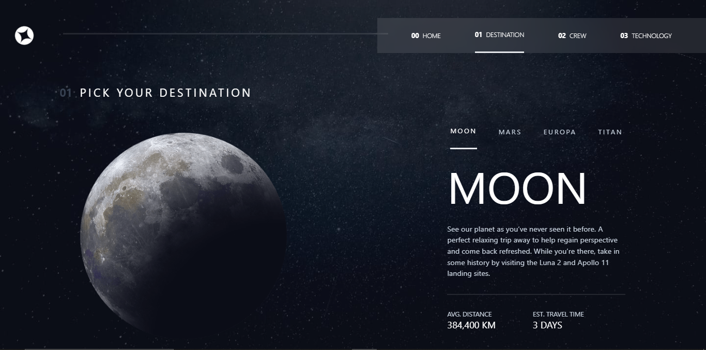
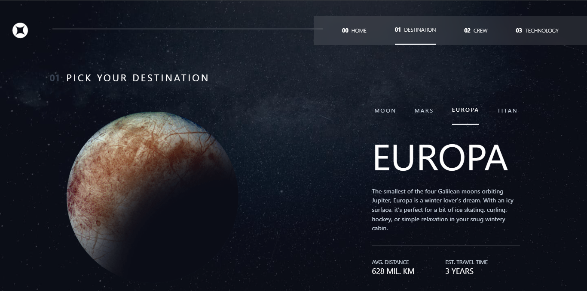
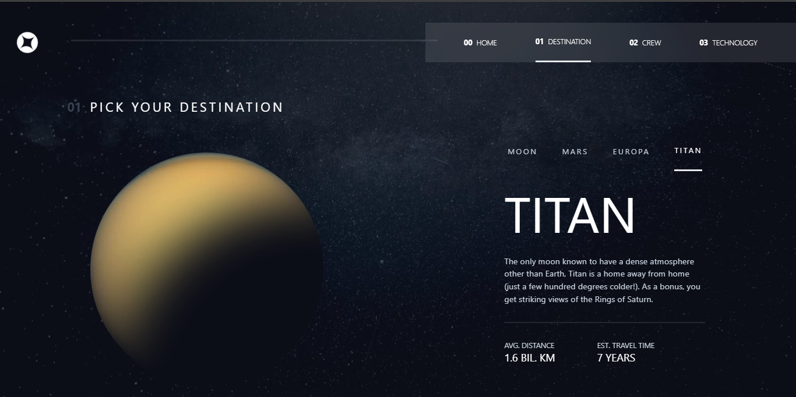
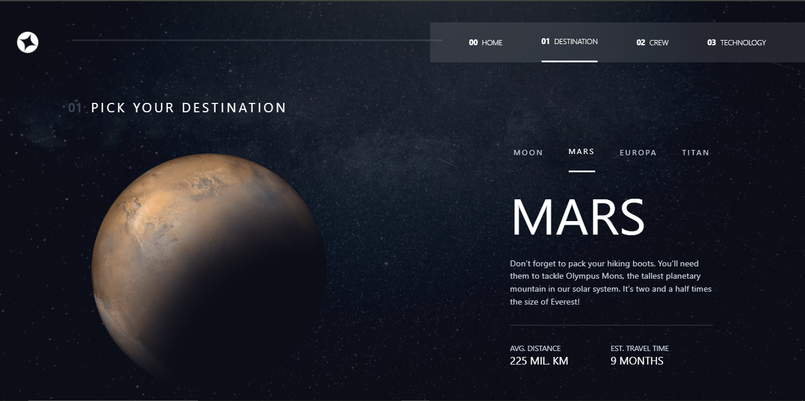

# Frontend Mentor - Space tourism website solution

This is a solution to the [Space tourism website challenge on Frontend Mentor](https://www.frontendmentor.io/challenges/space-tourism-multipage-website-gRWj1URZ3).

## Table of contents

- [Overview](#overview)
  - [The challenge](#the-challenge)
  - [Screenshot](#screenshot)
  - [Links](#links)
- [My process](#my-process)
  - [Built with](#built-with)
- [Author](#author)

## Overview

### The challenge

Users should be able to:

- View the optimal layout for each of the website's pages depending on their device's screen size
- See hover states for all interactive elements on the page
- View each page and be able to toggle between the tabs to see new information

### Screenshot

  

    
  

  

    
  

  

    
  

  

    
  

### Links

- Solution URL: [Add solution URL here](https://github.com/Oghenekparobo/space-tourism-fm)
- Live Site URL: [Add live site URL here](https://your-live-site-url.com)

## My process

### Built with

- Semantic HTML5 markup
- CSS custom properties - For animations
- Flexbox
- CSS Grid
- Mobile-first workflow
- [React](https://reactjs.org/) - JS library
- [https://tailwindcss.com](https://tailwindcss.com) - For styles

## Author

- Frontend Mentor - [@yourusername](https://www.frontendmentor.io/profile/Oghenekparobo)
- Twitter - [@stephenjyd](https://twitter.com/stephenjyd)
